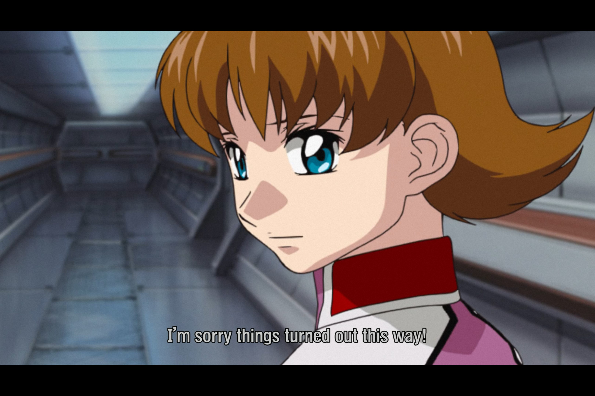

In my memory this whole Orb arc was a lot shorter, and perhaps the sense of inevitability is a part of that - somewhat like last episode, this episode showed events playing themselves out that felt to have already been firmly set in motion. The council meeting in the cold open shows something of a decision, but even that is very much the only possible decision that the characters (being generous to Azrael) in question could make.

Deakka has often struck me as an underused character; his story is much the same as that of our leads, but given far less attention. This episode jumps the gun a little - there's no need to explain why he'd want to shoot down Earth Federation forces - but his clear sympathy for the Archangel is intriguing, even if it seems to be more a mix of Stockholm syndrome and simping for Millie than any deep political conversion. Still, he's not the only character who seems to be thinking with his genitals.

I've said before that one of the most striking things about rewatching the early episodes was how much the naive kids turned out to be right, and the responsible adults turned out to be wrong. Ramius has discarded military discipline on every level now - disobeying orders herself, telling her crew she has no right to command them, and finally fraternizing openly in front of her subordinates - and the show is presenting this positively, just as it presents Kira, Athrun and now Deakka as being right to trust their personal friendships and feelings over more logical considerations. At the same time, one triumph (at least as I remember it) in the coming episodes is presenting Yzak and Flay's opposite paths sympathetically too: war can deepen some friendships but it can also shatter them, and while *Gundam Seed* is fundamentally against us-and-then binaries, it can at least offer some understanding for why people may turn in that direction.

Which makes the one-dimensional characterization of our new antagonists - both the leader Azrael, and the three mobile suit pilots - all the more disappointing; frankly the less said about them the better. Their evil is, well, cartoonish; Azrael doesn't convey any positive desire to protect the Earth, and there's a blatant hipocrisy in his embrace of these modified pilots while notionally fighting for the sake of a pure humanity. *Gundam Seed*'s balance is constrained by its premises - it's hard to tell a story about a war between enhanced superhumans and those who reject those enhancements on equal terms, by definition - but surely there were better ways to solve that than this.

On a personal note, I always expected this rewatch to be a long-term project, but life has gotten in the way a little more than I expected. I hope that coming back to this as someone who's emigrated to Japan will inform the project - both in terms of improved Japanese, and in terms divided loyalties - but I must admit nothing seems particularly different yet. Still, I want to make an effort to finish things.

